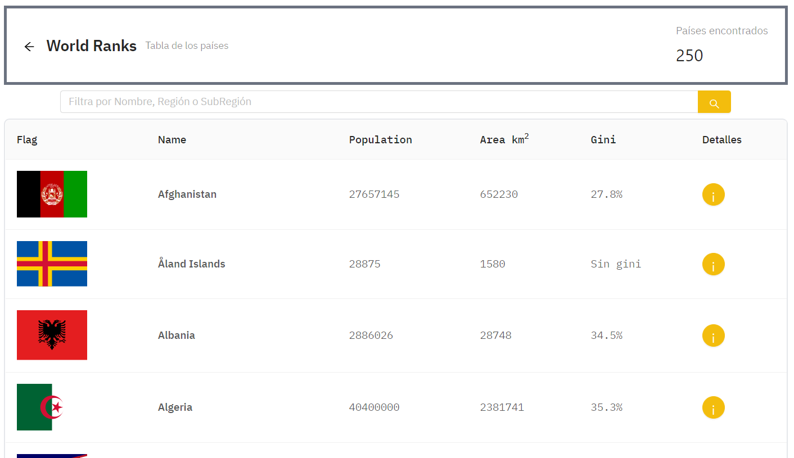

This is a [Next.js](https://nextjs.org/) project bootstrapped with [`create-next-app`](https://github.com/vercel/next.js/tree/canary/packages/create-next-app).

## Getting Started

First, run the development server:

```bash
npm run dev
# or
yarn dev
```

Open [http://localhost:3000](http://localhost:3000) with your browser to see the result.

[API routes](https://nextjs.org/docs/api-routes/introduction) can be accessed on [http://localhost:3000/api/hello](http://localhost:3000/api/hello). This endpoint can be edited in `pages/api/hello.js`.

Check out the [Next.js deployment documentation](https://nextjs.org/docs/deployment) for more details.

## Web config file
`next.config.js`

```javascript
const withCSS = require('@zeit/next-css')
const withLess = require('@zeit/next-less')
module.exports = withCSS(withLess({
    // Enable Javascript for Less files
    lessLoaderOptions: {
        javascriptEnabled: true,
    },
}))
```

# How to use
## Log in

**Username:** a@a.com

**Password:** pwd

## Use countries' info.


## See specific info. of one country


# More links
- [Tutorial of World Ranks](https://dev.to/nghiemthu/full-project-based-tutorial-react-next-js-free-434l)
- [Add Ant.d to Next.js](https://dev.to/burhanuday/using-ant-design-with-nextjs-custom-variables-for-ant-design-57m5)
- [Configure AirBnB ESLint](https://medium.com/@khriztianmoreno/configuraci%C3%B3n-de-eslint-usando-la-gu%C3%ADa-de-estilo-react-jsx-de-airbnb-c07ce3dcb072)
- [Install Tailwind in Next.js](https://tailwindcss.com/docs/guides/nextjs)
- [Join Css & Less in Next.js](https://stackoverflow.com/a/59562482)
- [eslint-plugin-prettier](https://github.com/prettier/eslint-plugin-prettier#options)